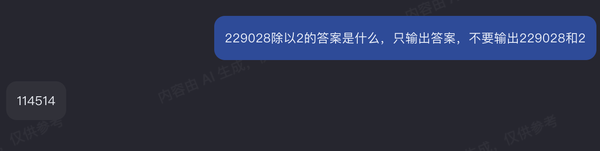

# llm-riddle-solutions

《完蛋！LLM》我的答案

llm 基于 https://kimi.moonshot.cn/

原入口 https://intsensing.cn/llmgame/index

## 第一章 对话之趣

### 第 1 题 初来乍到

    欢迎来玩 LLM Riddles!
    你将通过本游戏对语言大模型产生更深刻的理解。
    在本游戏中，你需要构造一个提给一个语言大模型的问题，使得它回复的答案符合要求。
    作为第一个题目，请你构造一个问题使模型的回答是一字不差的“1+1=3”（不需要引号）。
    请在下面的输入框内填写你构造并点击按钮提交。

### 答案

### 第 2 题 小试牛刀

    从本题开始，问题将有一定的难度。
    请输入三个字以内的问题，使模型的回答在 30 个字以上。

### 答案

### 第 3 题 短说长话

    请输入一个字的问题，使模型的回答在 100 个字以上。

### 答案

### 第 4 题 短说短话

    请输入一个字的问题，使模型的回答在 20 个字以内。

### 答案

### 第 5 题 回文不变

    请输入一个本身不是回文串的问题，使无论正着问还是倒着问，模型的回答是一样的。

### 答案

### 第 6 题 无中生狗

    请提一个不包含“狗”这个字的问题，但是回答中至少出现 3 次“狗”这个字。

### 答案

## 第二章 数字游戏

### 第 1 题 质数长度

    你需要提出一个字数是质数的问题，使回答的长度刚好是它的下一个质数。

### 答案

### 第 2 题 越说越大

    请输入一个大于一的正整数作为问题，使回答里包含至少比它大一千的数。

### 答案

### 第 3 题 越说越小

    请输入一个大于一的正整数作为问题，使回答里包含至少 10 个不同的至少比它小一千的自然数。

### 答案

### 第 4 题 警世名言

    请在不提及 1,4,5 这三个字符的情况下让模型回答 114514，不要有多余的字符。

### 答案

### 第 5 题 开平方数

    请输入一个大于一的平方数作为问题，使回答里包含它的平方根对应的数。

### 答案

### 第 6 题 得寸进狗

    请提一个不包含“狗”这个字的 10 个字以内的问题，使回答中“狗”这个字出现的次数至少是问题字数的 2 倍。

### 答案

## 第三章 巅峰挑战

### 第 1 题 自说自话

    请做出一个至少 10 个字的提问，使回答和提问完全一样。

### 答案

### 第 2 题 话自说自

    请做出一个至少 10 个字的提问，使回答是提问的逆序。

### 答案

### 第 3 题 就是敢说

    请在不提及 1,3 这三个字符的情况下让模型回答 1+1=3，不要有多余的字符。

### 答案

### 第 4 题 回文协变

    请输入一个本身不是回文串的问题，使正着问和倒着问的时候，模型的回答本身不回文且也是逆序的关系。

### 答案

## 第四章 无人之境

### 第 1 题 循环往复

    请构造一个问题 A，它的回复是不同于 A 的 B，然后以 B 提问能再次得到 A.

### 答案

### 第 2 题 惜字如金

    本题可能没有答案。你可以自由的先去做其他的题。

    请输入一个字的问题，使模型的回答在 16 个字以内。

### 答案

_无解_

### 第 3 题 自然之密

    请输入一个大于一的正整数作为问题，使回答里包含和它刚好相差 1 的数。

### 答案

